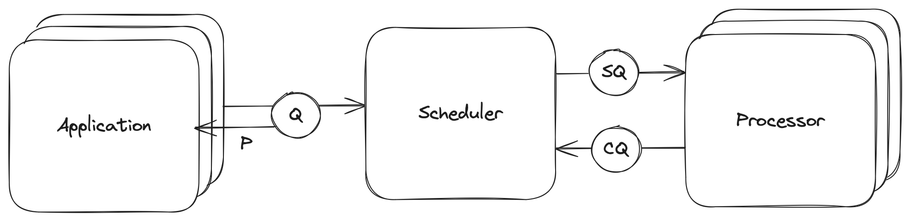

# Architecture

The event loop, core to the SDK, consist of three components:
- Application (multi-threaded)
- Scheduler (single-threaded)
- Processor (multi-threaded)

The diagram illustrates the interaction among the three components:

1. Application: This is where your business logic resides. It enqueues coroutines into the scheduler SDK via the `add(coro)` method. Upon adding a coroutine, you immediately receive a `Promise[T]`, which you can use later to await the result of the coroutine execution.
2. Scheduler: The scheduler receives numerous concurrent coroutines and orchestrates their execution. Importantly, the scheduler does not process any function itself. When it encounters a function that needs execution, it enqueues that function, along with its parameters, to the processor. The scheduler does not run functions directly because it operates on a single thread and we do not want to block its execution.
3. Processor: The processor executes functions received from the scheduler. Being multi-threaded, it can run many functions concurrently. Once a function completes, its result or error is enqueued into the completion queue (CQ), which then feeds back into the scheduler.
4. Scheduler: The scheduler retrieves results or errors from the CQ. These values are used to resolve promises and resume the execution of coroutines that are waiting for the resolution of a `Promise[T]`.
5. Application: Components of the application that are waiting for the `Promise[T]` resolution will receive the result or error returned from the coroutine execution.
